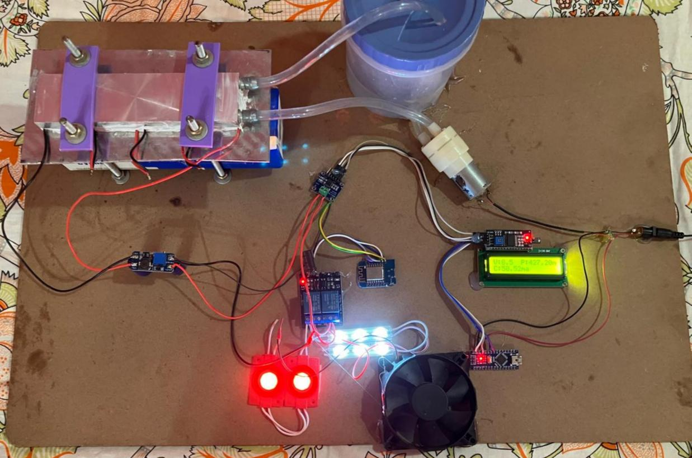
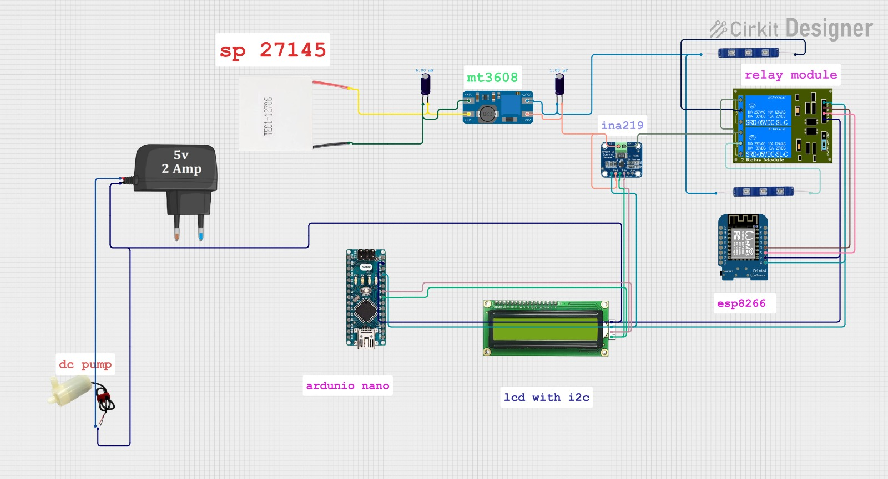
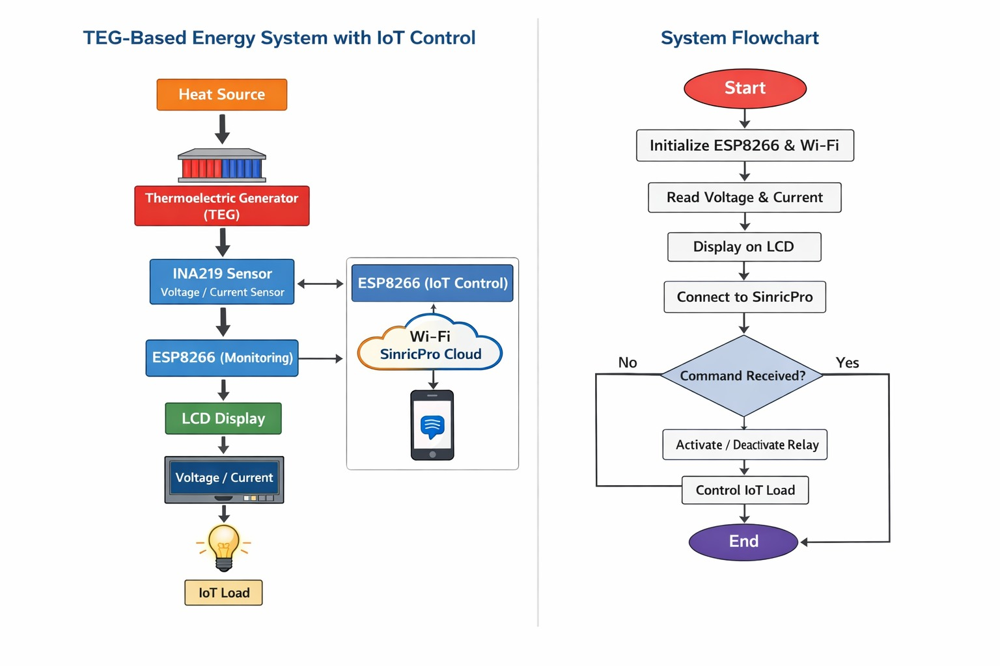
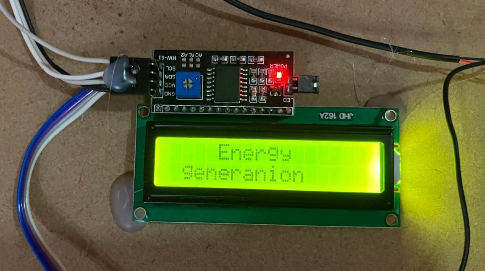
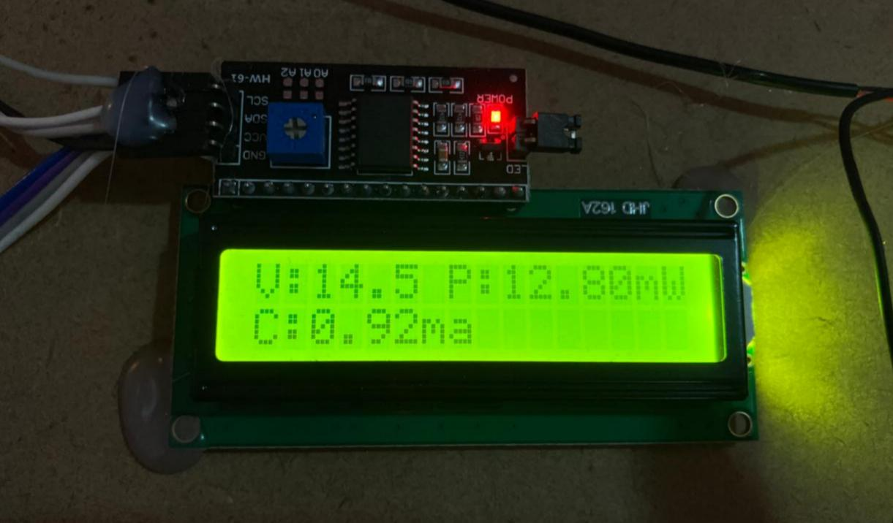
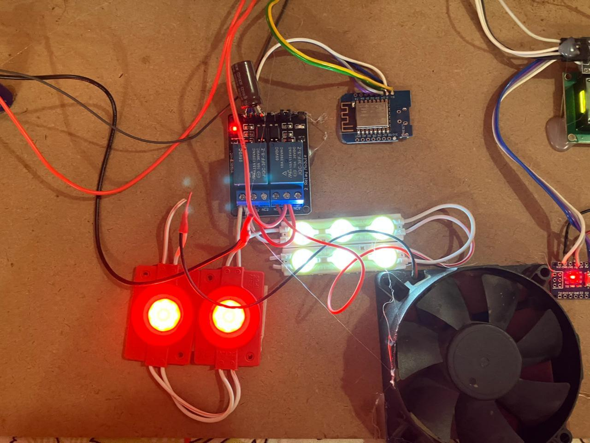

# Energy Generation from Bio-Waste and Utilisation with IoT

### Energy Harvesting • Thermoelectric Generator (TEG) • ESP8266 • IoT Load Control • Real-Time Monitoring

> **A collaborative project focused on harvesting electrical energy from bio-waste heat using a Thermoelectric Generator (TEG) and utilizing it to power IoT-controlled electrical loads via Wi-Fi and SinricPro. The system integrates real-time energy monitoring with remote load control.**

---

## 🤝 Authorship & Honesty Statement

**I, Khatija Mahveen, was a contributing team member on this project.** The core design, primary development, and implementation were led by my colleague.

### My Contribution involved:

* Collaborating on the technical documentation and report preparation
* Assisting with basic hardware testing and verification of sensor readings using the **INA219 and LCD**
* Participating in team discussions regarding the project architecture and functionality

> *I have uploaded this repository to showcase my ability to work in a collaborative team, but I do not claim sole ownership of this project. Full credit for the overall design and implementation goes to the primary author.*

---

## 🌱 The Core Idea

Energy demand is increasing rapidly with the growth of IoT devices. Conventional power sources are limited and can contribute to environmental pollution.

This project explores the use of a **Thermoelectric Generator (TEG)** to convert waste heat into electrical energy and utilize the harvested energy for low-power electronic and IoT applications.

The system combines **energy harvesting, real-time measurement, and Wi-Fi-based load control** into a single prototype.

---

## ⚙️ Working Principle — Seebeck Effect

The system is based on the **Seebeck Effect**: when a temperature difference exists across a thermoelectric material, an electrical voltage is generated.

### Main Components

* **TEG Module:** Converts a temperature difference into electrical energy.
* **Heat Source & Heat Sink:** Create the temperature gradient required for power generation.
* **INA219 Sensor:** Measures voltage, current, and power.
* **ESP8266 — Monitoring:** Reads sensor data and displays measurements on the LCD.
* **ESP8266 — IoT Control:** Communicates with SinricPro over Wi-Fi to control electrical loads remotely.

---

## 🛠️ System Architecture

### Energy Generation & Monitoring

```text
        Heat Source
            │
            ▼
 Thermoelectric Generator (TEG)
            │
            ▼
      Voltage Output
            │
            ▼
       INA219 Sensor
            │
            ▼
    ESP8266 (Monitoring)
            │
            ▼
       16×2 LCD Display
   (Voltage / Current / Power)
```

### IoT Load Control

```text
     ESP8266 (IoT Control)
             │
             ▼
       Wi-Fi Connection
             │
             ▼
       SinricPro Cloud
             │
             ▼
      Mobile Application
             │
             ▼
        Relay Module
             │
             ▼
            Load
```

---

## 🔄 Working Methodology

### 1. Energy Generation

A **TEG module** is placed between a heat source and a heat sink. The resulting temperature difference generates a DC voltage.

### 2. Voltage & Current Measurement

The generated output is monitored using the **INA219 sensor**, which measures:

* Bus voltage
* Load current
* Power

### 3. Real-Time Data Display

An **ESP8266** processes the sensor measurements and displays real-time electrical parameters on a **16×2 LCD**.

### 4. IoT Load Control

A second **ESP8266** connects to Wi-Fi and communicates with the **SinricPro cloud platform**, allowing connected loads such as lamps or small appliances to be controlled remotely.

### 5. Energy Utilisation

The harvested electrical energy is utilized for low-power applications while the system continuously monitors the generated electrical parameters.

---

## 📊 Key Advantages

* 🔋 **Waste Heat Recovery** — Utilizes heat energy that would otherwise be wasted.
* 📡 **Remote Load Control** — Enables Wi-Fi-based control of connected loads.
* 📈 **Real-Time Monitoring** — Measures and displays voltage, current, and power.
* 🌱 **Sustainable Energy Harvesting** — Explores an alternative source of electrical energy for low-power applications.
* ⚡ **Integrated Embedded System** — Combines energy harvesting, sensing, processing, and IoT control.

---

## 🖼️ Project Images

### Complete Experimental Setup



### Circuit Diagram



### Operational Flowchart



### Real-Time Voltage Monitoring



### Real-Time Current & Power Monitoring



### IoT Relay Activating Connected Loads



---

## 🧩 Technologies Used

### Hardware

* Thermoelectric Generator (TEG) Module
* INA219 High-Side Current Sensor
* ESP8266 Wi-Fi Microcontrollers ×2
* 16×2 LCD Display
* Relay Module

### Software & IoT

* **Arduino IDE**
* **Embedded C++**
* **SinricPro IoT Cloud Platform**

### Communication

* Wi-Fi
* I2C — INA219 / LCD communication

---

## 📂 Repository Structure

```text
Energy-Generation-Bio-Waste-IoT/
│
├── 📁 Images/
│   ├── Complete_setup.jpeg
│   ├── Circuitdiagram.jpeg
│   ├── Flowchart.jpeg
│   ├── Voltage_Monitoring.jpeg
│   ├── Current_power_monitoring.jpeg
│   └── Relay_Activating.jpeg
│
├── 📁 code/
│   ├── Appendix_A.ino
│   └── Appendix_B.ino
│
└── 📄 README.md
```

### Code Modules

| File             | Function                                     |
| ---------------- | -------------------------------------------- |
| `Appendix_A.ino` | Energy monitoring using INA219 and LCD       |
| `Appendix_B.ino` | IoT load control using ESP8266 and SinricPro |

---

## 🎓 Project Relevance

This project provided practical experience in:

* Energy harvesting using thermoelectric generation
* Sensor interfacing and electrical parameter measurement
* ESP8266-based embedded systems
* I2C communication
* Wi-Fi-based IoT control
* Relay-based load switching
* Real-time monitoring
* Collaborative engineering and technical documentation

---

## 🧑‍💻 Author & Team

### **Khatija Mahveen**

**Contributing Team Member**

* M.E. Embedded Systems & IoT | PhD Aspirant
* Research Intern — DRDO, Research Centre Imarat (RCI)
* Rank 1 in M.E. Embedded Systems

> **Note:** This was a collaborative project. Khatija Mahveen's contribution was primarily in documentation, basic hardware testing/verification, and team-level technical discussions. The core design and implementation were led by the primary project author.

---

## 📜 License

This project is licensed for **academic and research purposes**.
